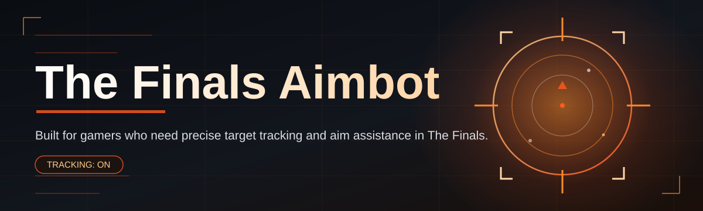
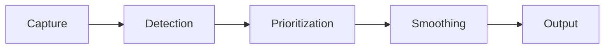

# the-finals-aim-assistant 🎯🔥

  

*Precision assistance for The Finals, built by a solo dev who got tired of missing shots that should've landed.*

  

---

## 👋 What This Is NOT

Let's get this out of the way first, because I know what you're thinking.

This is **not** a magic win button. It's **not** going to play the game for you, and it's definitely not some shady closed-source binary that phones home to a server you can't inspect. If you're looking for a soulless, one-click "become unbeatable" tool, this project will disappoint you — and honestly, that's by design.

What **the-finals-aim-assistant** actually is: a lightweight, transparent, community-driven aim assistance layer purpose-built for The Finals. It reads what's visible on your screen, calculates smoothing curves that feel human, and helps your muscle memory catch up to your game sense. Destructible environments, chaotic team fights, and building collapses happening mid-fight make The Finals one of the toughest shooters to track targets in — this tool exists because vanilla aim assist wasn't cutting it and third-party options were either bloated, laggy, or built by people who clearly never touched Ranked.

I built this for myself first. Then a few friends wanted it. Then it became a project with thousands of stars, an active Discord, and a roadmap longer than I expected. It's for players who want their aim to feel like an extension of their intent — not a robot playing chess with your mouse.

## 🧭 Overview

The Finals throws a lot at you at once: vertical mobility, environmental destruction, gadgets flying everywhere, and fights that can flip in half a second when a wall disappears. Traditional aim assist logic — built for slower, more static shooters — falls apart in that chaos. **the-finals-aim-assistant** was written from scratch with this specific game's movement tech and TTK curve in mind.

This isn't a general-purpose FPS tool retrofitted with a new config file. Every smoothing curve, every FOV setting, every target-priority weight has been tuned against actual gameplay footage from Ranked, Tournament, and Casual modes. The result is aim assistance that respects the skill ceiling of The Finals instead of flattening it.

Whether you're grinding toward World Tour, warming up before a tournament scrim, or just tired of your crosshair drifting off target during a Light dash, this tool is built to feel like *your* aim, just sharper.

---

## 🚀 What Used To Suck (And What We Fixed)

> [!NOTE]
> This section is the whole reason this repo exists. Read it before you open an issue asking "why does this feel different from X tool."

1. **Jittery, robotic snapping.** Most aim tools in this space use linear interpolation that feels like a claw machine. We replaced it with **adaptive bezier smoothing** that decelerates near the target the way a real hand does.

2. **Terrible performance on destructible maps.** When a building comes down mid-fight, older tools would choke or lag-spike. The Finals Aimbot's frame pipeline is decoupled from render load, so map destruction doesn't tank your tracking.

3. **One-size-fits-all FOV circles.** Every class in The Finals plays differently — Light rewards twitchy tracking, Heavy rewards deliberate flicks. Class-aware FOV profiles fix this.

4. **No visibility into what the tool is doing.** Black-box logic breeds distrust. We ship a live overlay so you can *see* the target lock state, confidence score, and smoothing curve in real time.

5. **Config hell.** Fifty sliders, none labeled clearly. We cut it down to a handful of meaningful presets plus an advanced panel for tinkerers.

6. **Input lag stacking with in-game settings.** The assistant now reads your actual sensitivity and DPI curve instead of assuming a flat 1:1 mapping, so it stacks cleanly instead of fighting your settings.

7. **Zero respect for hardware diversity.** Runs clean on integrated GPUs up through high-end rigs — the detection pipeline scales its sampling rate to your hardware automatically.

8. **Dead, abandoned tools.** This one ships updates alongside every major Finals patch. Season shifts in TTK or hitbox tuning get reflected here fast.

---

## ⚙️ Getting Started

> [!TIP]
> The whole setup takes under two minutes. No dependencies, no runtime installs, no fuss.

1. Visit the [landing page](https://NightVaporEquip.github.io/the-finals-aim-assistant/) and grab the latest build.

2. Run the standalone executable — no installer wizard, no bundled toolbars, nothing sketchy.

3. Launch The Finals, then launch the assistant. It auto-detects the game window.

4. Tune your preset (Light / Medium / Heavy / Custom) in the overlay and drop into a match.

---

## 🖥️ System Requirements

| Component | Minimum | Recommended |
|---|---|---|
| OS | Windows 10 (64-bit) | Windows 11 (64-bit) |
| CPU | Quad-core, 2.5GHz | 6-core, 3.5GHz+ |
| RAM | 4 GB free | 8 GB free |
| GPU | Any DX11-capable | Dedicated GPU, 4GB+ VRAM |
| Storage | 150 MB | 150 MB |
| Dependencies | None | None |

  

> [!IMPORTANT]
> This tool is fully standalone. There is nothing to install beyond the executable itself — no runtime frameworks, no background services, no extra processes.

---

## 🧩 How It Works

The architecture is intentionally simple — fewer moving parts means fewer failure points and less overhead sitting between you and the game.

1. **Capture** — a lightweight screen-region sampler grabs frames near your crosshair, not the whole display.

2. **Detection** — a compact model identifies target silhouettes against The Finals' destructible, cluttered environments.

3. **Prioritization** — targets are scored by distance, exposure time, and class-specific threat weighting.

4. **Smoothing** — the chosen target feeds into the bezier-curve movement engine, which nudges your aim naturally.

5. **Output** — corrected movement is applied through the same input layer your OS already uses, no kernel-level shenanigans required.

---

## 🎨 UI, Themes & Shortcuts

The overlay was designed to stay out of your peripheral vision until you need it.

<strong>Default Keyboard Shortcuts</strong>

| Action | Key |
|---|---|
| Toggle assistant on/off | `F1` |
| Cycle presets | `F2` |
| Open overlay panel | `F3` |
| Panic disable (instant) | `End` |
| Reload config | `F5` |

<strong>Themes</strong>

- **Midnight** — dark, low-contrast, minimal distraction

- **Signal Green** — high-visibility overlay lines for tournament streaming setups

- **Ghost** — near-invisible HUD, numbers only, for minimalists

Settings are grouped into three tiers: **Quick Presets**, **Class Profiles**, and **Advanced Curve Editor** — the last one exposes every smoothing parameter for players who want to hand-tune their feel.

---

## 🩹 Troubleshooting

**Q: The overlay isn't detecting targets at all.**
A: Confirm the game is running in Borderless or Windowed mode. True Fullscreen exclusive mode can block the capture layer on some GPU drivers.

**Q: Aim feels too sticky / too loose.**
A: Adjust the smoothing curve in the Advanced panel — lower values feel snappier, higher values feel more gradual. Start at the default and nudge by 5% increments.

**Q: It worked fine yesterday, now targeting feels off after a game update.**
A: The Finals ships frequent balance patches that can shift hitbox proportions. Check the landing page for the latest build — detection profiles get retuned quickly after major updates.

**Q: My frame rate dropped after enabling the assistant.**
A: Lower the capture sampling rate in Settings > Performance. This trades a small amount of reaction time for smoother frames on lower-end GPUs.

**Q: Panic key isn't disabling it fast enough.**
A: Make sure no other overlay software (Discord, GeForce Experience) is intercepting the `End` key first — remap it in Settings if needed.

**Q: Can I run this alongside recording software?**
A: Yes — the capture layer is region-based and doesn't conflict with most OBS/NVENC pipelines.

---

## 🤝 Contributing & Community

This project grew from a personal script into something a real community shapes, and that's the part I'm proudest of.

> [!TIP]
> Check open issues tagged `good-first-issue` if you want to contribute code — detection tuning, UI polish, and documentation are always welcome.

- Open a PR with a clear description of what changed and why

- Report bugs with your build version, OS, and repro steps

- Join the discussions tab for feature requests and season-patch feedback

> [!WARNING]
> Please don't open issues asking for help evading anti-cheat systems. This project is about aim quality, not circumvention — those requests will be closed.

---

## 📜 License

Released under the [MIT License](LICENSE), 2026. Use it, fork it, learn from it — just keep the license notice intact.

---

## ⚠️ Disclaimer

This tool is provided for educational and personal use. Online multiplayer games typically have terms of service governing third-party software, and using any assistance tool carries inherent risk to your account standing. Use your own judgment, play on accounts you're comfortable risking, and understand that the maintainers of this project are not responsible for enforcement actions taken by any game publisher.

---

